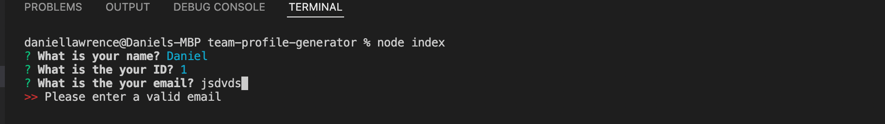

# Team Profile Generator

## Description

This application allows for details of software engineering teams to be entered and a html document to be generated displaying these details with a summary for each member of the team. There are also numerous tests run which ensure the right information is added for each team member. The team manager is added first, followed by engineers and interns depending on what is chosen at the relevant prompt. Once finish is selected the html document is generated displaying all the input information.

## Installation

This project relies on node.js as its runtime environment so that will need to be installed for it to be ran. The github repo can then be cloned to run the package and when npm install is ran it will install the relevant dependencies for the app and testing

## Usage

To start the app please type node index.js which will display the first prompt.

Answer the questions as they appear by either typing the answer for an input or selecting the relevant option from the list. All questions are validated so a response must be added, with other validations in place so that numbers are added for id only and actual email addresses are used as shown below.

Once all questions have been answered for the manager you can choose which type of team members to add or whether to finish.

After all team members added and finish is selected this is the final output of the html document

## Tests

Once npm install has been ran to install the dependencies for this project please run npm test and the tests will run for this project

After the tests have been run by typing npm test into command line the following should appear:

## Walkthrough Video

## Questions

Please direct all questions to [Dan Lawrence](https://github.com/DanLawrence91)
